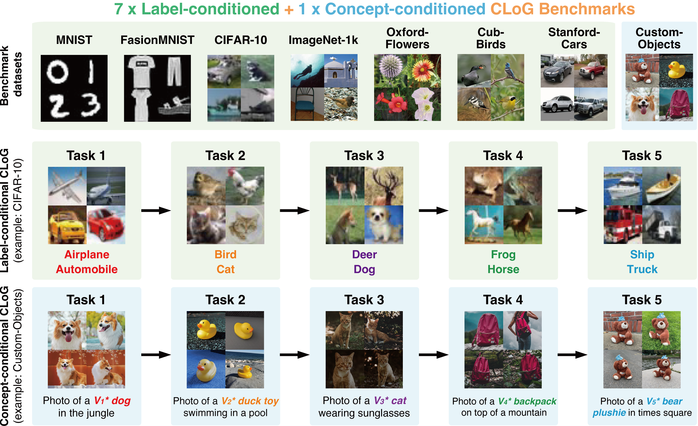

<p align="center">
  <a href="https://github.com/linhaowei1/CLoG">
    
  </a>
</p>

<div align="center">
<div align="center">
   | [日本語](docs/README_JP.md) | [English](https://github.com/linhaowei1/CLoG) | [中文简体](docs/README_CN.md) | [中文繁體](docs/README_TW.md) |
</div>


---
<p align="center">
Code and data for our paper <a href="#">CLoG: Benchmarking Continual Learning of Image Generation Models</a>
    </br>
    </br>
    <a href="https://www.python.org/">
        
    </a>
</p>


## 📰 News
* **[Jun. 7, 2024]**: Our codebase will be launched soon! Stay tuned.


## 👋 Overview
We advocates for shifting the research focus from classification-based continual learning (CL) to **continual learning of generative models (CLoG)**. Our codebase adapts three types of existing CL methodologies—replay-based, regularization-based, and parameter-isolation-based methods—to generative tasks and introduce 8 benchmarks for CLoG that feature great diversity and broad task coverage. 




## 🚀 Set Up
To run CLoG from source, follow these steps:
1. Clone this repository locally
2. `cd` into the repository.
3. Run `conda env create -f environment.yml` to created a conda environment named `CLoG`
4. Activate the environment with `conda activate CLoG`

## 💽 Usage
Coming soon!

## ⬇️ Downloads
comming soon!


## 💫 Contributions
We would love to hear from the broader CL community, Machine Learning, and generative AI communities, and we welcome any contributions, pull requests, or issues!
To do so, please either file a new pull request or issue. We'll be sure to follow up shortly!


## ✍️ Citation
If you find our work helpful, please use the following citations.
```
@article{
    zhang2024clog,
    title={CLoG: Benchmarking Continual Learning of Image Generation Models},
    author={Haotian Zhang and Junting Zhou and Haowei Lin and Hang Ye and Jianhua Zhu and Zihao Wang and Liangcai Gao and Yizhou Wang and Yitao Liang},
    booktitle={arxiv},
    year={2024}
}
```

## 🪪 License
MIT. Check `LICENSE.md`.